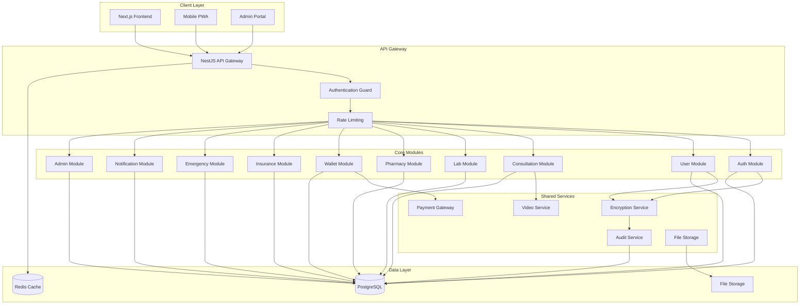
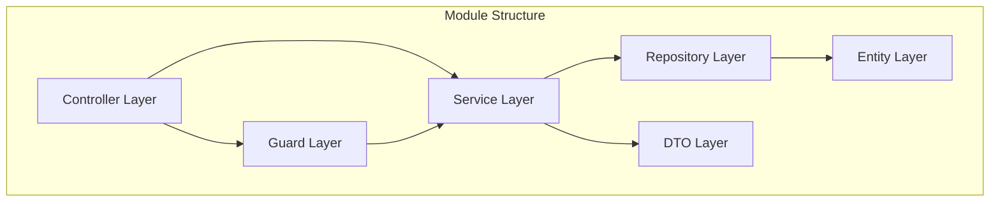
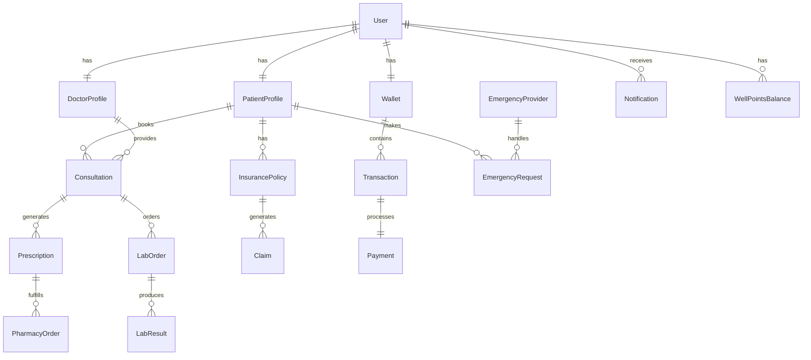
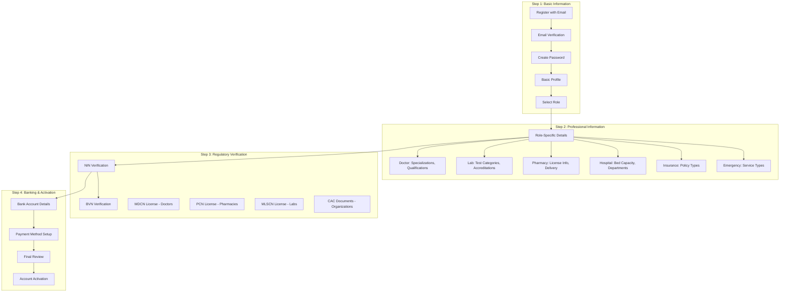
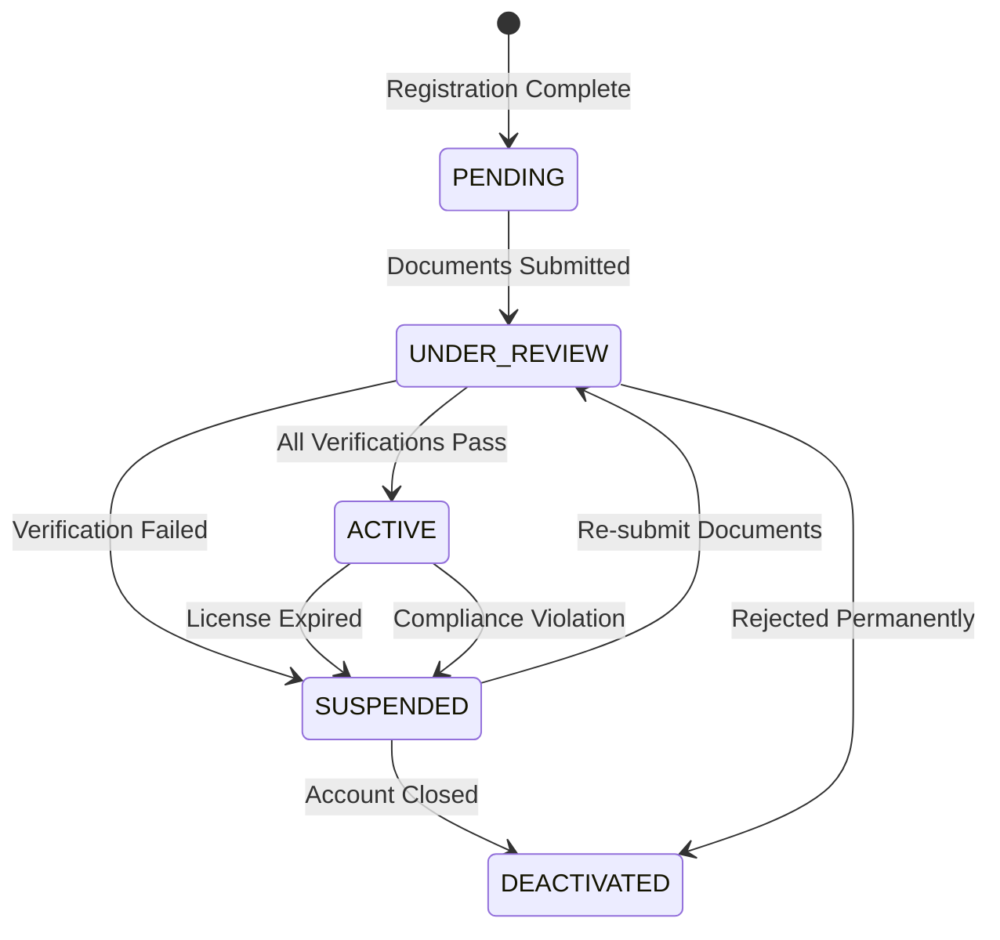

# WellBank Design Document

## Overview

WellBank is a modular healthcare coordination platform built as a NestJS modular monolith with a Next.js frontend. The system follows Domain-Driven Design principles with each healthcare domain (Patients, Doctors, Labs, Insurance, Wallet) implemented as self-contained modules. The architecture prioritizes security, scalability, and compliance with healthcare regulations while providing a seamless user experience across multiple user roles.

The platform serves as a unified healthcare ecosystem connecting patients to various healthcare providers through secure, encrypted communications and wallet-based payments. The design emphasizes mobile-first responsive interfaces with dark mode support, ensuring accessibility and usability across different devices and network conditions.

## Architecture

### System Architecture



### Module Architecture

Each domain module follows a consistent internal structure:



### Technology Stack

**Backend:**

- **Framework:** NestJS with TypeScript
- **Database:** PostgreSQL with TypeORM
- **Caching:** Redis
- **Authentication:** JWT with Passport.js (tokens stored in Redis)
- **Identity Verification:** Dojah for NIN/BVN verification and KYC
- **Payment Processing:** BudPay integration (https://budpay.com/ng)
- **File Storage:** Cloudflare R2 or S3-compatible object storage
- **Background Jobs:** BullMQ with Redis for async workflows
- **Events:** NestJS EventEmitter2 for in-memory cross-module communication
- **Video Conferencing:** WebRTC with Socket.io
- **Payment Processing:** BudPay integration (https://budpay.com/ng)
- **Configuration:** Centralized config service (no direct process.env usage)
- **Data Residency:** Nigeria-compliant cloud regions (AWS Cape Town/Azure Nigeria)

**Frontend:**

- **Framework:** Next.js 14 with App Router
- **Styling:** Tailwind CSS (utility-first)
- **Icons:** Lucide-react (clean, consistent line icons)
- **Forms:** React Hook Form with Zod validation
- **UI Components:** Radix UI/shadcn (ARIA-compliant)
- **State Management:** Zustand
- **Real-time:** Socket.io client

**Infrastructure:**

- **Development:** Hybrid Docker Compose approach
  - Services (PostgreSQL, Redis, message queues) in Docker containers
  - Application runs locally with npm commands for developer convenience
- **File Storage:** Cloudflare R2 or S3-compatible storage
- **Monitoring:** Prometheus + Grafana
- **Error Monitoring:** Sentry (for unexpected errors only)
- **Logging:** Winston with intelligent error filtering

## Components and Interfaces

### Authentication Module

**Core Components:**

- `AuthController`: Handles login, registration, password reset
- `AuthService`: Business logic for authentication
- `JwtStrategy`: JWT token validation
- `RoleGuard`: Role-based access control
- `MfaService`: Multi-factor authentication for providers
- `AuditService`: Activity logging and audit trails

**Key Interfaces:**

```typescript
interface User {
  id: string;
  email: string;
  role: UserRole;
  isVerified: boolean;
  isKycVerified: boolean; // Dojah NIN/BVN verification
  mfaEnabled: boolean;
  createdAt: Date;
  updatedAt: Date;
}

interface AuthTokens {
  accessToken: string;
  refreshToken: string;
  expiresIn: number;
  // Tokens stored in Redis, not database
}

interface LoginRequest {
  email: string;
  password: string;
  mfaCode?: string;
}
```

### User Profile Module

**Core Components:**

- `ProfileController`: Profile management endpoints
- `ProfileService`: Profile business logic
- `MedicalRecordService`: Medical records management
- `ConsentService`: Data access consent management
- `EncryptionService`: Medical data encryption

**Key Interfaces:**

```typescript
interface PatientProfile {
  id: string;
  userId: string;
  firstName: string;
  lastName: string;
  dateOfBirth: Date;
  gender: Gender;
  phoneNumber: string;
  nin: string; // National Identification Number (to be verified later)
  address: Address;
  emergencyContacts: EmergencyContact[];
  medicalHistory: MedicalRecord[];
  allergies: string[];
  medications: string[];
}

interface MedicalRecord {
  id: string;
  patientId: string;
  type: RecordType;
  data: EncryptedData;
  providerId: string;
  createdAt: Date;
  accessLog: AccessLog[];
}
```

### Consultation Module

**Core Components:**

- `ConsultationController`: Booking and management
- `ConsultationService`: Business logic
- `VideoService`: WebRTC video conferencing
- `SchedulingService`: Appointment scheduling
- `PrescriptionService`: Prescription management

**Key Interfaces:**

```typescript
interface Consultation {
  id: string;
  patientId: string;
  doctorId: string;
  type: ConsultationType;
  status: ConsultationStatus;
  scheduledAt: Date;
  duration: number;
  fee: number;
  notes: string;
  prescriptions: Prescription[];
  labOrders: LabOrder[];
}

interface Doctor {
  id: string;
  userId: string;
  licenseNumber: string;
  licenseVerificationStatus: VerificationStatus; // Admin verification required
  specialties: Specialty[];
  qualifications: Qualification[];
  availability: AvailabilitySlot[];
  consultationFee: number;
  rating: number;
  reviewCount: number;
  hasAmbulance: boolean; // For emergency services
}
```

### Laboratory Module

**Core Components:**

- `LabController`: Test ordering and results
- `LabService`: Laboratory business logic
- `TestCatalogService`: Available tests management
- `ResultService`: Test results processing
- `CollectionService`: Sample collection scheduling

**Key Interfaces:**

```typescript
interface LabOrder {
  id: string;
  patientId: string;
  doctorId: string;
  labId: string;
  tests: LabTest[];
  status: LabOrderStatus;
  collectionType: CollectionType;
  scheduledAt?: Date;
  results?: LabResult[];
  totalCost: number;
}

interface LabTest {
  id: string;
  name: string;
  code: string;
  description: string;
  cost: number;
  preparationInstructions: string;
  turnaroundTime: number;
}
```

### Pharmacy Module

**Core Components:**

- `PharmacyController`: Medication ordering
- `PharmacyService`: Pharmacy business logic
- `InventoryService`: Medication availability
- `DeliveryService`: Delivery management
- `PrescriptionValidationService`: Prescription verification

**Key Interfaces:**

```typescript
interface PharmacyOrder {
  id: string;
  patientId: string;
  pharmacyId: string;
  prescriptionId: string;
  medications: OrderedMedication[];
  deliveryType: DeliveryType; // PICKUP or USER_ARRANGED_DELIVERY (MVP)
  deliveryAddress?: Address;
  status: OrderStatus;
  totalCost: number;
  pickupInstructions?: string; // For store pickup
}

interface Medication {
  id: string;
  name: string;
  genericName: string;
  dosage: string;
  form: MedicationForm;
  manufacturer: string;
  price: number;
  inStock: boolean;
}
```

### Wallet Module

**Core Components:**

- `WalletController`: Wallet operations
- `WalletService`: Wallet business logic
- `PaymentService`: Payment processing
- `TransactionService`: Transaction management
- `FraudDetectionService`: Security monitoring

**Key Interfaces:**

```typescript
interface Wallet {
  id: string;
  userId: string;
  balance: number;
  currency: string;
  isActive: boolean;
  transactions: Transaction[];
  paymentMethods: PaymentMethod[];
}

interface Transaction {
  id: string;
  walletId: string;
  type: TransactionType;
  amount: number;
  description: string;
  status: TransactionStatus;
  reference: string;
  createdAt: Date;
}
```

### Insurance Module

**Core Components:**

- `InsuranceController`: Coverage verification
- `InsuranceService`: Insurance business logic
- `ClaimsService`: Claims processing
- `EligibilityService`: Coverage verification
- `PolicyService`: Policy management

**Key Interfaces:**

```typescript
interface InsurancePolicy {
  id: string;
  patientId: string;
  providerId: string;
  policyNumber: string;
  coverageType: CoverageType;
  coverageLimit: number;
  deductible: number;
  copayment: number;
  isActive: boolean;
  expiresAt: Date;
}

interface Claim {
  id: string;
  policyId: string;
  serviceId: string;
  amount: number;
  status: ClaimStatus;
  submittedAt: Date;
  processedAt?: Date;
  approvedAmount?: number;
}
```

### Emergency Module

**Core Components:**

- `EmergencyController`: Emergency requests
- `EmergencyService`: Emergency business logic
- `LocationService`: GPS tracking
- `DispatchService`: Provider assignment
- `NotificationService`: Emergency alerts

**Key Interfaces:**

```typescript
interface EmergencyRequest {
  id: string;
  patientId: string;
  location: GPSLocation;
  type: EmergencyType;
  status: EmergencyStatus;
  assignedProviderId?: string;
  dispatchedAt?: Date;
  arrivedAt?: Date;
  completedAt?: Date;
}

interface EmergencyProvider {
  id: string;
  name: string;
  type: ProviderType;
  location: GPSLocation;
  isAvailable: boolean;
  responseTime: number;
  equipment: string[];
}
```

### Provider Verification Module

**Core Components:**

- `ProviderVerificationController`: License verification endpoints
- `ProviderVerificationService`: Healthcare provider verification logic
- `DojahService`: Identity and license verification integration
- `DocumentService`: License document management
- `OnboardingService`: Multi-step provider onboarding workflows

**Key Interfaces:**

```typescript
interface ProviderVerification {
  id: string;
  providerId: string;
  providerType: ProviderType; // doctor, pharmacy, lab
  licenseNumber: string;
  licenseDocument: string; // File URL
  verificationStatus: VerificationStatus;
  reviewedBy?: string; // Admin ID
  reviewedAt?: Date;
  rejectionReason?: string;
  expiresAt: Date;
}

enum VerificationStatus {
  PENDING = "pending",
  APPROVED = "approved",
  REJECTED = "rejected",
  EXPIRED = "expired"
}

interface OnboardingStep {
  id: string;
  providerId: string;
  stepType: OnboardingStepType;
  status: StepStatus;
  data: any;
  completedAt?: Date;
}

enum OnboardingStepType {
  BASIC_INFO = "basic_info",
  IDENTITY_VERIFICATION = "identity_verification", // Dojah NIN/BVN
  LICENSE_VERIFICATION = "license_verification",
  DOCUMENT_UPLOAD = "document_upload",
  ADMIN_REVIEW = "admin_review",
  PROFILE_SETUP = "profile_setup"
}
```

### Background Jobs and Events Module

**Core Components:**

- `EventEmitterService`: In-memory cross-module communication
- `QueueService`: BullMQ background job processing
- `WebhookService`: External service webhook handling (BudPay webhooks)
- `NotificationQueueService`: Async notification processing

**Key Interfaces:**

```typescript
interface BackgroundJob {
  id: string;
  type: JobType;
  data: any;
  status: JobStatus;
  attempts: number;
  scheduledAt?: Date;
  completedAt?: Date;
  error?: string;
}

enum JobType {
  PAYMENT_RECONCILIATION = "payment_reconciliation",
  MEDICAL_RECORD_ENCRYPTION = "medical_record_encryption",
  EMAIL_NOTIFICATION = "email_notification",
  PROVIDER_VERIFICATION = "provider_verification",
  AUDIT_LOG_PROCESSING = "audit_log_processing"
}

interface DomainEvent {
  id: string;
  type: string;
  aggregateId: string;
  data: any;
  occurredAt: Date;
}
```

## Data Models

### Core Entity Relationships



### Database Schema Design

**Users Table:**

```sql
CREATE TABLE users (
    id UUID PRIMARY KEY DEFAULT gen_random_uuid(),
    email VARCHAR(255) UNIQUE NOT NULL,
    password_hash VARCHAR(255) NOT NULL,
    role user_role NOT NULL,
    is_verified BOOLEAN DEFAULT FALSE,
    mfa_enabled BOOLEAN DEFAULT FALSE,
    mfa_secret VARCHAR(255),
    created_at TIMESTAMP DEFAULT NOW(),
    updated_at TIMESTAMP DEFAULT NOW()
);
```

**Patient Profiles Table:**

```sql
CREATE TABLE patient_profiles (
    id UUID PRIMARY KEY DEFAULT gen_random_uuid(),
    user_id UUID REFERENCES users(id) ON DELETE CASCADE,
    first_name VARCHAR(100) NOT NULL,
    last_name VARCHAR(100) NOT NULL,
    date_of_birth DATE NOT NULL,
    gender gender_enum NOT NULL,
    phone_number VARCHAR(20) NOT NULL,
    address JSONB NOT NULL,
    emergency_contacts JSONB NOT NULL,
    allergies TEXT[],
    chronic_conditions TEXT[],
    created_at TIMESTAMP DEFAULT NOW(),
    updated_at TIMESTAMP DEFAULT NOW()
);
```

**Medical Records Table:**

```sql
CREATE TABLE medical_records (
    id UUID PRIMARY KEY DEFAULT gen_random_uuid(),
    patient_id UUID REFERENCES patient_profiles(id) ON DELETE CASCADE,
    provider_id UUID REFERENCES users(id),
    record_type record_type_enum NOT NULL,
    encrypted_data TEXT NOT NULL,
    encryption_key_id VARCHAR(255) NOT NULL,
    created_at TIMESTAMP DEFAULT NOW(),
    INDEX idx_patient_records (patient_id, created_at),
    INDEX idx_provider_records (provider_id, created_at)
);
```

### Data Encryption Strategy

**Encryption Layers:**

1. **Database Level:** Transparent Data Encryption (TDE) for PostgreSQL
2. **Application Level:** AES-256 encryption for sensitive medical data
3. **Transport Level:** TLS 1.3 for all network communications
4. **Field Level:** Individual encryption for PII and medical records

**Key Management:**

- AWS KMS or HashiCorp Vault for key management
- Key rotation every 90 days
- Separate encryption keys per data type
- Hardware Security Module (HSM) for key storage

## Correctness Properties

_A property is a characteristic or behavior that should hold true across all valid executions of a system—essentially, a formal statement about what the system should do. Properties serve as the bridge between human-readable specifications and machine-verifiable correctness guarantees._

Before defining the correctness properties, I need to analyze the acceptance criteria from the requirements document to determine which ones are testable as properties.

### Authentication and Access Control Properties

**Property 1: User Registration Validation**
_For any_ user registration attempt, if the credentials are valid and unique, then an account should be created and verification should be sent; if credentials are invalid or duplicate, then registration should be rejected with clear error messages.
**Validates: Requirements 1.1, 1.2**

**Property 2: Authentication and Authorization**
_For any_ login attempt, if credentials are correct and the user is verified, then authentication should succeed and redirect to the role-appropriate dashboard; if credentials are incorrect, then login should be rejected with rate limiting after multiple failures.
**Validates: Requirements 1.3, 1.4**

**Property 3: Role-Based Access Control**
_For any_ user and system feature, the user should only be able to access features appropriate to their role, and healthcare providers should be required to use multi-factor authentication.
**Validates: Requirements 1.5, 1.8**

**Property 4: Password Security**
_For any_ password input, the system should enforce strong password policies (minimum 8 characters, mixed case, numbers, symbols) and provide secure reset functionality with 24-hour expiration.
**Validates: Requirements 1.6, 1.7**

### Medical Records and Data Security Properties

**Property 5: Medical Record Encryption and Audit**
_For any_ medical record operation (create, update, access), the data should be encrypted using end-to-end encryption, audit logs should be created with timestamp/user/purpose, and access should require patient consent.
**Validates: Requirements 2.2, 2.3, 2.5, 2.6**

**Property 6: Patient Data Control**
_For any_ patient, they should be able to grant and revoke medical record access permissions to specific healthcare providers, and account deletion should anonymize records while preserving aggregate data.
**Validates: Requirements 2.4, 2.7**

**Property 7: Profile Data Collection**
_For any_ patient profile creation, essential demographic and medical history information should be collected and properly stored.
**Validates: Requirements 2.1**

### Consultation and Booking Properties

**Property 8: Doctor Discovery and Search**
_For any_ doctor search, results should be filtered by specialty, location, availability, and ratings, and doctor profiles should display qualifications, specialties, availability, fees, and reviews.
**Validates: Requirements 3.1, 3.2**

**Property 9: Consultation Booking Validation**
_For any_ consultation booking attempt, if the slot is available, it should be reserved with confirmations sent to both parties; if unavailable, booking should be prevented with alternative suggestions.
**Validates: Requirements 3.3, 3.4**

**Property 10: Consultation Cancellation Rules**
_For any_ consultation, cancellation should be allowed up to 2 hours before scheduled time, and cancellations within 2 hours should apply fees per doctor's policy.
**Validates: Requirements 3.5, 3.6**

**Property 11: Consultation Reminders**
_For any_ scheduled consultation, automated reminders should be sent 24 hours and 1 hour before the appointment.
**Validates: Requirements 3.7**

### Telehealth Properties

**Property 12: Telehealth Session Security and Performance**
_For any_ telehealth session, it should provide secure video/audio communication with <300ms latency, verify participant identities, allow sharing capabilities, and automatically save session data to medical records.
**Validates: Requirements 4.1, 4.2, 4.3, 4.4**

**Property 13: Telehealth Communication Features**
_For any_ telehealth session, it should provide encrypted in-session chat, graceful degradation under poor connectivity, duration recording, and emergency escalation capabilities.
**Validates: Requirements 4.5, 4.6, 4.7, 4.8**

### Laboratory Services Properties

**Property 14: Lab Test Ordering and Scheduling**
_For any_ lab test prescription, patients should be able to search and select laboratory providers, book tests with home collection or lab visit options, and receive pre-test instructions.
**Validates: Requirements 5.1, 5.2, 5.3**

**Property 15: Lab Results Management**
_For any_ lab result, patients and prescribing doctors should be notified when ready, results should be encrypted and stored in medical records, provided in standardized downloadable format, and laboratories should be able to update test status.
**Validates: Requirements 5.4, 5.5, 5.6, 5.7**

### Pharmacy Services Properties

**Property 16: Prescription and Pharmacy Management**
_For any_ prescription issued by a doctor, it should be made available to the patient for pharmacy fulfillment, pharmacy searches should show medication availability and delivery options, and patients should be able to choose pickup or delivery.
**Validates: Requirements 6.1, 6.2, 6.3**

**Property 17: Medication Delivery and Tracking**
_For any_ medication delivery order, real-time tracking and estimated delivery time should be provided, prescription authenticity should be verified, duplicate fulfillment should be prevented, and medical records should be updated when dispensed.
**Validates: Requirements 6.4, 6.5, 6.6**

**Property 18: Medication Management**
_For any_ patient with medications, the system should send medication reminders and refill notifications.
**Validates: Requirements 6.7**

### Wallet and Payment Properties

**Property 19: Wallet Functionality**
_For any_ patient, they should have a digital wallet that supports multiple funding methods, provides transaction history and receipts, and implements fraud detection and monitoring.
**Validates: Requirements 7.1, 7.2, 7.5, 7.7**

**Property 20: Payment Processing**
_For any_ healthcare service completion, payment should be automatically deducted from the patient's wallet; if balance is insufficient, booking should be prevented with funding suggestions; cancellations and refunds should automatically credit the wallet.
**Validates: Requirements 7.3, 7.4, 7.6**

**Property 21: Insurance Payment Integration**
_For any_ transaction, the system should support split payments between wallet funds and insurance coverage.
**Validates: Requirements 7.8**

### Insurance Properties

**Property 22: Insurance Coverage Verification**
_For any_ insurance policy linking, coverage details should be verified with the provider, and real-time eligibility verification should occur before service delivery.
**Validates: Requirements 8.1, 8.6**

**Property 23: Insurance Claims Processing**
_For any_ covered service, claims should be automatically submitted to insurance providers, coverage should be checked during booking with financial responsibility displayed, and audit trails should be maintained.
**Validates: Requirements 8.2, 8.3, 8.7**

**Property 24: Insurance Payment Handling**
_For any_ insurance claim, if partially covered, remaining amount should be charged to wallet; if denied, patient should be notified and full amount charged to wallet.
**Validates: Requirements 8.4, 8.5**

### Emergency Services Properties

**Property 25: Emergency Access and Response**
_For any_ screen in the application, an emergency button should be accessible, and when activated, should capture GPS location and connect to the nearest available emergency provider.
**Validates: Requirements 9.1, 9.2, 9.3**

**Property 26: Emergency Data Sharing and Tracking**
_For any_ emergency request, patient medical records and emergency contacts should be shared with the provider, real-time tracking should be provided, and emergency contacts should be notified when services are dispatched.
**Validates: Requirements 9.4, 9.5, 9.7**

### Notification and Communication Properties

**Property 27: Notification Delivery**
_For any_ relevant event (appointments, test results, prescriptions), push notifications should be sent, critical health information should trigger immediate multi-channel notifications, and users should be able to customize preferences.
**Validates: Requirements 10.1, 10.2, 10.3**

**Property 28: Secure Messaging**
_For any_ message from healthcare providers, it should be delivered securely with recipient notification, the system should provide in-app messaging with end-to-end encryption, and notification history should be maintained with read/unread functionality.
**Validates: Requirements 10.4, 10.5, 10.6**

**Property 29: Offline Notification Handling**
_For any_ notification when the app is offline, it should be queued and delivered when connectivity is restored.
**Validates: Requirements 10.7**

### WellPoints Rewards Properties

**Property 30: WellPoints Earning and Management**
_For any_ health activity completion (consultations, lab tests, medication adherence), WellPoints should be awarded, bonus points should be provided for milestones, and fraud prevention should validate all earning activities.
**Validates: Requirements 11.1, 11.2, 11.7**

**Property 31: WellPoints Redemption and Marketplace**
_For any_ WellPoints transaction (earning or redemption), patient balance should be updated with transaction details, redemption should work for healthcare service discounts, and a marketplace should be available for browsing rewards.
**Validates: Requirements 11.3, 11.4, 11.5**

**Property 32: WellPoints Expiration Management**
_For any_ WellPoints, expiration policies should be implemented and patients should be notified before points expire.
**Validates: Requirements 11.6**

### Admin Portal Properties

**Property 33: Admin Dashboard and Monitoring**
_For any_ WellBank admin, they should have access to a comprehensive dashboard showing platform metrics and user activities, receive alerts for suspicious activities with investigation tools, and be able to manage user accounts.
**Validates: Requirements 12.1, 12.2, 12.3**

**Property 34: Admin Configuration and Compliance**
_For any_ administrative action, audit logs should be created with timestamp and admin identification, admins should be able to configure platform settings and business rules, and compliance reporting tools should be available.
**Validates: Requirements 12.4, 12.5, 12.6**

**Property 35: Provider Management**
_For any_ healthcare provider onboarding, WellBank admins should be able to manage the onboarding and verification process.
**Validates: Requirements 12.7**

### Security and Compliance Properties

**Property 36: Data Encryption**
_For any_ medical record, personal data, or user communication, appropriate encryption should be applied (AES-256 for data, end-to-end for communications, TLS 1.3+ for transmission).
**Validates: Requirements 13.1, 13.2, 13.3**

**Property 37: Data Rights and Residency**
_For any_ user, data export and deletion capabilities should be provided, Nigerian user data should be kept within Nigeria, and intrusion detection/prevention systems should be active.
**Validates: Requirements 13.5, 13.6, 13.8**

### Performance Properties

**Property 38: Application Performance**
_For any_ application load, it should complete in less than 3 seconds on standard mobile connections, and under concurrent user access, response times should remain under 2 seconds for all operations.
**Validates: Requirements 14.1, 14.2**

**Property 39: System Resilience and Optimization**
_For any_ high system load, graceful degradation should occur without service interruption, caching should optimize frequently accessed data, and performance monitoring should alert administrators of degradation.
**Validates: Requirements 14.4, 14.6, 14.7**

### User Interface Properties

**Property 40: Responsive Design and Accessibility**
_For any_ device type (mobile, tablet, desktop), the interface should work seamlessly with responsive design, implement dark mode with high contrast, use bento grid layouts for dashboards, and ensure touch-friendly interactive elements.
**Validates: Requirements 15.1, 15.2, 15.4, 15.5**

**Property 41: Progressive Web App Features**
_For any_ user, the application should implement PWA features for offline functionality and optimize images/assets for fast loading on mobile networks.
**Validates: Requirements 15.6, 15.7**

## Error Handling

### Error Classification

**System Errors:**

- Database connection failures
- External service unavailability (payment gateways, insurance providers)
- Network connectivity issues
- Server overload conditions

**User Errors:**

- Invalid input data
- Insufficient permissions
- Expired sessions
- Insufficient wallet balance

**Business Logic Errors:**

- Double booking attempts
- Prescription validation failures
- Insurance coverage denials
- Emergency service unavailability

### Error Handling Strategy

**Graceful Degradation:**

- Video calls degrade to audio-only under poor connectivity
- Offline functionality for critical features using PWA capabilities
- Cached data display when real-time data is unavailable
- Alternative payment methods when primary method fails

**User Communication:**

- Clear, non-technical error messages
- Actionable suggestions for error resolution
- Progress indicators for long-running operations
- Confirmation dialogs for destructive actions

**System Recovery:**

- Automatic retry mechanisms with exponential backoff
- Circuit breaker patterns for external service calls
- Database transaction rollback on failures
- Session recovery after network interruptions

**Logging and Monitoring:**

- Structured logging with correlation IDs
- Real-time error alerting for critical failures
- Performance metrics collection
- Security event monitoring

## Testing Strategy

### Dual Testing Approach

The testing strategy employs both unit testing and property-based testing as complementary approaches:

**Unit Tests:**

- Focus on specific examples, edge cases, and error conditions
- Test integration points between modules
- Verify specific business rules and calculations
- Test error handling scenarios

**Property-Based Tests:**

- Verify universal properties across all inputs through randomization
- Test system behavior with generated data sets
- Validate correctness properties defined in this design
- Ensure comprehensive input coverage

### Property-Based Testing Configuration

**Framework Selection:**

- **TypeScript/JavaScript:** fast-check library
- **Minimum Iterations:** 100 per property test
- **Test Tagging:** Each property test must reference its design document property

**Example Property Test Structure:**

```typescript
// Feature: wellbank, Property 1: User Registration Validation
describe("Authentication Properties", () => {
  it("should validate user registration correctly", () => {
    fc.assert(
      fc.property(
        fc.record({
          email: fc.emailAddress(),
          password: fc.string({ minLength: 8 }),
          role: fc.constantFrom("patient", "doctor", "lab", "pharmacy")
        }),
        (userData) => {
          // Test that valid credentials create account and send verification
          // Test that invalid/duplicate credentials are rejected with clear errors
        }
      ),
      { numRuns: 100 }
    );
  });
});
```

### Testing Coverage Requirements

**Module Testing:**

- Each domain module must have comprehensive unit tests
- Property-based tests for all correctness properties
- Integration tests for module interactions
- End-to-end tests for critical user journeys

**Security Testing:**

- Penetration testing for authentication and authorization
- Encryption validation tests
- Data privacy compliance verification
- OWASP security testing guidelines

**Performance Testing:**

- Load testing for concurrent user scenarios
- Stress testing for system limits
- Latency testing for real-time features (video calls)
- Mobile network performance testing

**Compliance Testing:**

- NDPR compliance verification
- Healthcare data protection validation
- Audit trail completeness testing
- Data residency compliance verification

### Error Monitoring and Logging Strategy

**Intelligent Error Filtering:**

- **Log to Sentry:** Unexpected errors requiring developer intervention
  - Database connection failures
  - Unhandled exceptions
  - Third-party service failures
  - Security breaches
- **Don't Log to Sentry:** Expected errors not requiring intervention
  - User validation errors
  - Authentication failures
  - Business rule violations
  - Rate limiting triggers

**Error Classification Middleware:**

```typescript
@Catch()
export class GlobalExceptionFilter implements ExceptionFilter {
  catch(exception: unknown, host: ArgumentsHost) {
    const shouldLogToSentry = this.isUnexpectedError(exception);

    if (shouldLogToSentry) {
      Sentry.captureException(exception);
    }

    // Always log to Winston for debugging
    this.logger.error(exception);
  }
}
```

### Configuration Management

**Centralized Configuration Service:**

```typescript
@Injectable()
export class ConfigService {
  private readonly config: Config;

  constructor() {
    this.config = {
      database: {
        host: process.env.DB_HOST || "localhost",
        port: parseInt(process.env.DB_PORT) || 5432
        // ... other config
      },
      redis: {
        host: process.env.REDIS_HOST || "localhost",
        port: parseInt(process.env.REDIS_PORT) || 6379
      },
      budpay: {
        apiKey: process.env.BUDPAY_API_KEY,
        secretKey: process.env.BUDPAY_SECRET_KEY
      }
    };
  }

  get database() {
    return this.config.database;
  }
  get redis() {
    return this.config.redis;
  }
  get budpay() {
    return this.config.budpay;
  }
}
```

**Usage in Services:**

```typescript
@Injectable()
export class PaymentService {
  constructor(private configService: ConfigService) {}

  async processPayment() {
    const budpayConfig = this.configService.budpay;
    // Use budpayConfig instead of direct process.env access
  }
}
```

### Development Environment Setup

**Docker Compose for Services:**

```yaml
# docker-compose.dev.yml
version: "3.8"
services:
  postgres:
    image: postgres:15
    environment:
      POSTGRES_DB: wellbank_dev
      POSTGRES_USER: dev_user
      POSTGRES_PASSWORD: dev_password
    ports:
      - "5432:5432"
    volumes:
      - postgres_data:/var/lib/postgresql/data

  redis:
    image: redis:7-alpine
    ports:
      - "6379:6379"
    volumes:
      - redis_data:/data

  postgres-test:
    image: postgres:15
    environment:
      POSTGRES_DB: wellbank_test
      POSTGRES_USER: test_user
      POSTGRES_PASSWORD: test_password
    ports:
      - "5433:5432"

  redis-test:
    image: redis:7-alpine
    ports:
      - "6380:6379"

volumes:
  postgres_data:
  redis_data:
```

**Application Startup:**

```bash
# Start services
docker-compose -f docker-compose.dev.yml up -d

# Start backend application
cd backend
npm run start:dev

# Start frontend application
cd frontend
npm run dev
```

This hybrid approach allows developers to:

1. Quickly start dependency services with Docker
2. Run the application locally with familiar npm commands
3. Have full debugging capabilities in their IDE
4. Easily modify and restart the application without container rebuilds

## MVP Scope and Deferred Features

### Included in MVP

**Core Healthcare Functionality:**

- Patient registration and profile management with Dojah KYC
- Doctor/Provider onboarding with admin verification workflow
- Consultation booking and basic telehealth (WebRTC)
- Lab test ordering and results management
- Pharmacy ordering with store pickup
- Wallet and payment processing with BudPay
- Basic insurance integration
- Emergency dispatch to hospitals with ambulances
- Email and in-app notifications
- WellPoints rewards system
- Admin portal with provider verification

**Technical Infrastructure:**

- NestJS modular monolith with TypeORM
- Next.js frontend with Radix UI/shadcn
- PostgreSQL + Redis with Docker Compose for services
- Background jobs with BullMQ
- Centralized configuration management
- Comprehensive testing strategy

### Deferred for Post-MVP

**Complex Integrations:**

- Third-party logistics partners for delivery
- SMS notifications (email + in-app sufficient for MVP)
- Advanced video conferencing features (Agora integration)
- Complex insurance claim processing (Wefill integration)
- Dedicated ambulance/emergency service providers

**Advanced Features:**

- AI-powered health recommendations
- Telemedicine prescription validation
- Advanced analytics and reporting
- Multi-language support
- Advanced audit and compliance reporting

### Key Architectural Decisions

1. **TypeORM over Prisma**: Better alignment with NestJS modular architecture
2. **Hybrid Docker Approach**: Services containerized, app runs locally for developer convenience
3. **BullMQ for Background Jobs**: Essential for payment reconciliation and cross-module communication
4. **Provider Verification Workflow**: Critical for healthcare compliance and legal requirements
5. **Nigeria Data Residency**: AWS Cape Town or Azure Nigeria regions for NDPR compliance

### Provider Onboarding Flows

**Doctor Onboarding:**

1. Basic registration and email verification
2. Dojah NIN/BVN verification
3. Medical license upload and verification
4. Admin review and approval
5. Profile setup (specialties, availability, fees)
6. Account activation

**Pharmacy/Lab Onboarding:**

1. Basic registration and email verification
2. Business registration document upload
3. License/certification verification (PCN for pharmacy)
4. Admin review and approval
5. Service catalog setup
6. Account activation

**Hospital Onboarding:**

1. Basic registration and email verification
2. Hospital license and accreditation documents
3. Emergency service capabilities (ambulance availability)
4. Admin review and approval
5. Service setup and staff account creation
6. Account activation

### Provider Onboarding Journey Diagrams



### Activation Flow



### License Auto-Suspension Logic

The system MUST implement automated controls to trigger suspension when licenses expire:

```typescript
// Automated License Expiry Check
@Injectable()
export class LicenseExpiryService {
  @Cron('0 0 * * *') // Daily at midnight
  async checkExpiredLicenses() {
    const expiredProviders = await this.providerRepository.find({
      where: {
        licenseExpiryDate: LessThanOrEqual(new Date())
      }
    });

    for (const provider of expiredProviders) {
      await this.suspendProvider(provider.id, 'LICENSE_EXPIRED');
      await this.notifyProvider(provider.id, 'License Expired');
      await this.notifyAdmins(provider.id, 'Provider License Expired');
    }
  }

  private async suspendProvider(providerId: string, reason: string) {
    await this.providerRepository.update(providerId, {
      status: ProviderStatus.SUSPENDED,
      suspensionReason: reason,
      suspendedAt: new Date()
    });
  }
}
```

### Role-Specific Onboarding Requirements

| Role | Step 1 | Step 2 | Step 3 | Step 4 |
|------|--------|--------|--------|--------|
| Patient | Basic Info | Medical History | NIN/BVN | Wallet Setup |
| Doctor | Basic Info | Qualifications | MDCN + NIN | Banking |
| Laboratory | Basic Info | Test Categories | MLSCN + CAC | Banking |
| Pharmacy | Basic Info | Inventory Info | PCN + CAC | Banking |
| Hospital | Basic Info | Departments | CAC + Facilities | Banking |
| Insurance | Basic Info | Policy Types | Regulatory Docs | Banking |
| Emergency | Basic Info | Service Types | Operating License | Banking |
| Provider Admin | Basic Info | Organization | CAC | Banking |

This design provides a solid foundation for a healthcare platform that can scale while maintaining compliance with Nigerian healthcare regulations and data protection requirements.

## NDPR Compliance and Data Protection Framework

### Data Residency Strategy

**Primary Storage:**

- **Health Records**: AWS Cape Town (af-south-1) for African continent preference
- **User Data**: Cloudflare R2 with jurisdiction constraint to closest African region
- **Session Data**: Redis instances in Nigerian data centers where possible

**Secondary Backup (Data Sovereignty):**

- **Local Backup Provider**: Galaxy Backbone, MainOne, or Rack Centre (Nigerian providers)
- **Backup Frequency**: Real-time replication for critical health data, daily backups for other data
- **Data Mapping Document**: Maintain detailed documentation of data location by type

### Technical Security Compliance Checklist

#### ✅ Encryption Requirements

- [ ] **Encryption at Rest**: AES-256 for all patient records in databases and file storage
- [ ] **Encryption in Transit**: TLS 1.3 for all data transmission
- [ ] **End-to-End Encryption**: Medical records and communications between users
- [ ] **Key Management**: AWS KMS or HashiCorp Vault with 90-day key rotation

#### ✅ Access Control Requirements

- [ ] **Multi-Factor Authentication**: Mandatory for all healthcare providers
- [ ] **Role-Based Access Control**: Principle of least privilege implementation
- [ ] **Granular Permissions**: Pharmacists see prescription ID only, not full medical history
- [ ] **Session Management**: JWT tokens with short expiration, stored in Redis
- [ ] **Account Lockout**: Rate limiting and temporary lockout after failed attempts

#### ✅ Data Anonymization and Pseudonymization

- [ ] **Analytics Data**: Separate health trends from patient identifiers
- [ ] **Audit Logs**: Pseudonymized patient references in system logs
- [ ] **Research Data**: Anonymized datasets for platform improvement
- [ ] **Data Retention**: Automated deletion of expired data per retention policies

### Administrative and Legal Compliance

#### ✅ Governance Requirements

- [ ] **Data Protection Officer (DPO)**: Designated DPO with contact information in privacy policy
- [ ] **Data Protection Impact Assessment (DPIA)**: Comprehensive risk assessment document
- [ ] **Privacy Policy**: Layered, just-in-time privacy notices
- [ ] **Terms of Service**: NDPR-compliant user agreements
- [ ] **Third-Party Agreements**: Data Processing Agreements (DPAs) with all providers

#### ✅ User Rights Implementation

- [ ] **Right to Access**: User dashboard showing all collected data
- [ ] **Right to Rectification**: Self-service data correction capabilities
- [ ] **Right to Erasure**: Account deletion with data anonymization
- [ ] **Right to Portability**: Data export in machine-readable format
- [ ] **Right to Object**: Opt-out mechanisms for non-essential processing

#### ✅ Consent Management

- [ ] **Explicit Consent**: Clear consent forms for data collection
- [ ] **Granular Consent**: Separate consent for different data uses
- [ ] **Consent Withdrawal**: Easy mechanism to withdraw consent
- [ ] **Consent Records**: Audit trail of all consent actions
- [ ] **Medical Record Sharing**: Patient consent required for provider access

### Incident Response Framework

#### ✅ Breach Detection and Response

- [ ] **Monitoring Systems**: Real-time security monitoring and alerting
- [ ] **Incident Response Plan**: Written procedures for security breaches
- [ ] **72-Hour Notification**: Process to notify NDPC within 72 hours of high-risk breaches
- [ ] **User Notification**: Process to notify affected users of breaches
- [ ] **Forensic Capabilities**: Ability to investigate and document security incidents

#### ✅ Business Continuity

- [ ] **Backup and Recovery**: Tested backup and disaster recovery procedures
- [ ] **Data Integrity**: Checksums and validation for critical health data
- [ ] **Service Availability**: 99.9% uptime SLA with monitoring
- [ ] **Failover Procedures**: Automated failover to backup systems

### Audit and Compliance Monitoring

#### ✅ Audit Trail Requirements

- [ ] **User Actions**: Log all access to medical records with timestamp, user, purpose
- [ ] **System Changes**: Log all configuration and data modifications
- [ ] **API Access**: Log all external system integrations and data exchanges
- [ ] **Administrative Actions**: Log all admin panel activities
- [ ] **Data Exports**: Log all data export and sharing activities

#### ✅ Regular Compliance Activities

- [ ] **Monthly Security Reviews**: Regular security posture assessments
- [ ] **Quarterly Compliance Audits**: Internal compliance verification
- [ ] **Annual Penetration Testing**: Third-party security testing
- [ ] **Staff Training**: Regular NDPR and security awareness training
- [ ] **Policy Updates**: Regular review and update of privacy policies

### Implementation Priority

**Phase 1 (MVP Launch):**

- Basic encryption and access controls
- Privacy policy and consent management
- Audit logging for medical record access
- Data backup to Nigerian provider

**Phase 2 (Post-MVP):**

- Advanced monitoring and alerting
- Comprehensive DPIA completion
- Third-party security audit
- Enhanced user rights implementation

**Phase 3 (Scale):**

- Full compliance automation
- Advanced threat detection
- Regulatory reporting automation
- International expansion compliance

### Compliance Validation

```typescript
// Example compliance validation service
@Injectable()
export class ComplianceService {
  async validateDataAccess(
    userId: string,
    resourceId: string,
    purpose: string
  ) {
    // Check user permissions
    const hasPermission = await this.checkPermissions(userId, resourceId);

    // Log access attempt
    await this.auditService.logAccess({
      userId,
      resourceId,
      purpose,
      timestamp: new Date(),
      granted: hasPermission
    });

    // Verify consent if accessing medical records
    if (this.isMedicalRecord(resourceId)) {
      const hasConsent = await this.checkPatientConsent(resourceId, userId);
      return hasPermission && hasConsent;
    }

    return hasPermission;
  }
}
```

This framework ensures WellBank meets all NDPR requirements while maintaining the flexibility to scale and adapt to changing regulatory requirements.
